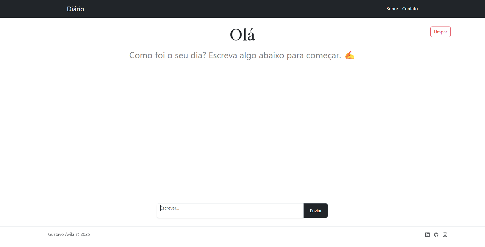

# Daily Journal App 📝

A simple web-based journal application that allows users to write, post, and delete their daily thoughts.

## 📸 Preview



## 📌 Features

- Write and post text entries about your day
- View your submitted entries
- Delete the last entry submitted
- Clear all entries with one click

## 🛠️ Technologies Used

- Node.js with Express
- EJS (Embedded JavaScript Templates)
- Bootstrap 5
- HTML, CSS
- Body-parser middleware

## 📁 Project Structure

```
├── public/             # Static files (CSS, images, JS)
├── views/              # EJS views (index and partials)
│   ├── partials/       # Header and footer partials
├── app.js              # Main server file
├── package.json
```

## 🚀 Getting Started

1. Clone this repository
2. Install dependencies:
    ```bash
    npm install
    ```
3. Run the server:
    ```bash
    node app.js
    ```
4. Open your browser at `http://localhost:3000`

## ✏️ Usage

- Type your thoughts in the input field and click "Enviar" to submit.
- Use the "Limpar" button to clear all entries.
- Each entry appears with a delete icon that allows removing the most recent post.

## 👤 Author

Made with ❤️ by Gustavo Ávila — 2025
